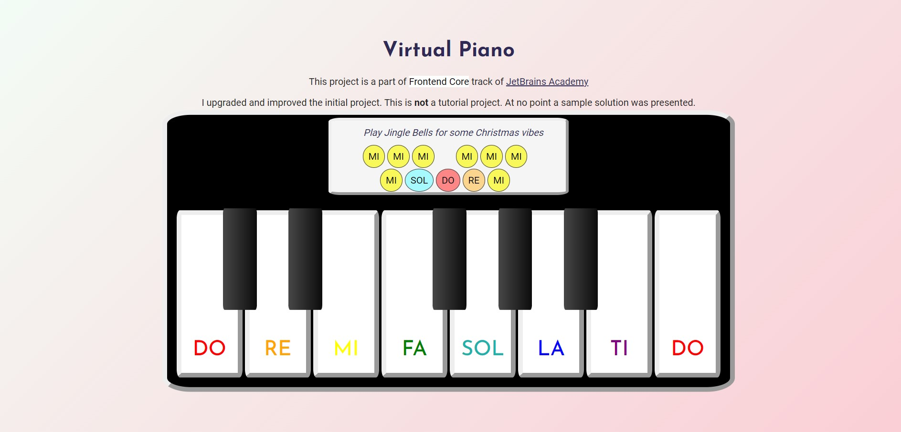

# Virtual Piano

## About
Virtual Piano started as a mini-project of Frontend Core Track of JetBrains Academy. I upgraded the project: changed layout, added more keys, changed sounds, added on-click event, added sample song to play

### Layout
  

### Completed using:

* `HTML`
* `CSS`
* `JavaScript`
